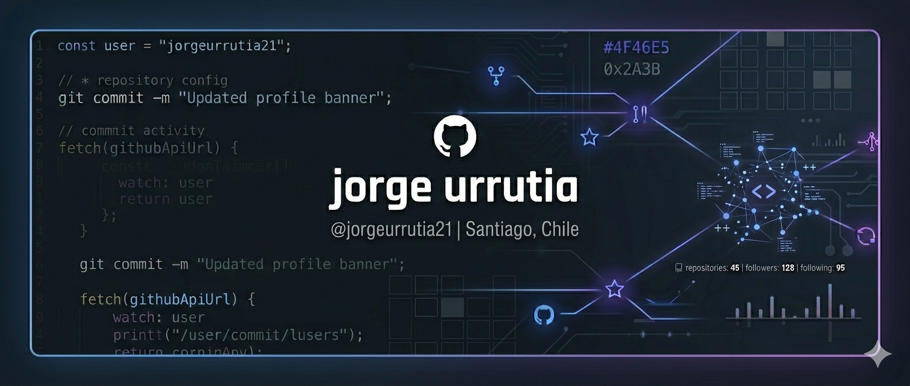

  
  

<<<<<<< HEAD

=======

Front-End Development Student
Building web experiences with HTML, JavaScript, and Vue.js.

>>>>>>> 2d418a58a466662e9cc6ee4e66e9fc00a05a2c45

 

Técnico en Soporte TI con experiencia en entornos corporativos y resolución de incidencias.  
En formación como Front-End Developer, desarrollando habilidades en JavaScript, Vue.js, HTML y CSS.

 

<h3 align="center">IT Support & Systems</h3>

<h3 align="center">Front-End Development</h3>

 

<h2 align="center">📊 GitHub Metrics</h2>

<h2 align="center">📈 Activity</h2>

